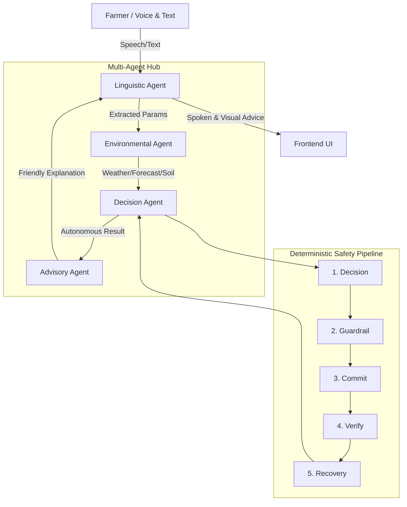

<div align="center">
  <h1>🚜 AI Autonomous Farming Operator</h1>
  <h3>Multi-Agent Conversational AI & Autonomous Decision Engine</h3>
</div>

---

## 📌 Project Overview
The **AI Autonomous Farming Operator** is a Prototype with deployment-ready architecture built to autonomously authorize and manage large-scale farming operations—like **Planting, Irrigation, Fertilization, and Harvesting**. 

This system represents a major leap in agricultural tech by combining a **deterministic, LLM-free safety pipeline** with a **Conversational Multi-Agent layer**. Farmers can interact with the system via text or Voice. Currently supports English + Hindi, with extensibility to regional languages (Marathi, Gujarati, Punjabi). The operator doesn't just give advice—it reasons across 5-day weather forecasts and soil data to make binding operational decisions.

> **Unlike advisory tools, this system takes responsibility for decisions by committing actions, verifying outcomes, and correcting failures.**

### 💰 Business Impact & ROI
*   **Prevents fertilizer loss** in high-rain scenarios (estimated 30–40% cost savings).
*   **Reduces unsafe farming decisions** via deterministic guardrail enforcement.
*   **Enables autonomous recovery** from incorrect environmental predictions, saving operational time.

> ⚠️ **Core AI Philosophy**: Gemini is used as an adaptive reasoning layer, not as a source of ground-truth agronomic data. All critical decisions are validated through deterministic guardrails.

## ✨ Key Hackathon Highlights
*   **🤖 Multi-Agent Orchestration**: Specialized agents: **Linguistic Agent** (input), **Environmental Agent** (data aggregation), **Decision Agent** (pipeline execution), and **Advisory Agent** (human-friendly explanation).
*   **🌍 Dynamic Crop Reasoning**: Supports dynamic crop evaluation using LLM-based reasoning (extensible to broader agronomy datasets).
*   **🎙️ Premium Neural Voice TTS**: Integrated cloud-based `edge-tts` to replace native robotic browser synthesis, delivering immersive speech as asynchronous Base64 streams.
*   **⚡ Aggressive Latency Minimization**: Heavily optimized response times by fusing multi-modal AI instructions into single-shot prompts, running OpenWeather API checks concurrently via `asyncio`, and decoupling the heavy audio TTS engine into an independent `/tts` background endpoint.
*   **🛑 Hard-Stop Orchestrator Bypass**: The safety pipeline is an absolute dictatorship. If the Guardrail Agent flags dangerous conditions or missing core user data (e.g. unknown crop), it intercepts and **immediately halts** execution of downstream components (Commit, Verify, Recover), aggressively saving CPU cycles and LLM tokens.
*   **📱 Zero-Idle Progressive UX**: The frontend simulates the live asynchronous execution of all agents via a staggered loading checklist, ensuring farmers are never left staring at a blank "consulting" screen.

---


## 🏗️ Multi-Agent Architecture

The system follows a modular, agentic workflow that ensures safety while providing a seamless user experience.



### 1. Linguistic Agent (LA)
The interaction specialist. It transcribes audio, detects languages, and uses "Slot Filling" logic to ensure all necessary parameters (`crop`, `location`, `task`) are extracted. If info is missing, it initiates a follow-up request in the farmer's native language.

### 2. Environmental Agent (EA)
The data harvester. It reasons across live 5-day forecasts and current weather APIs. It provides a comprehensive context that goes beyond the "now," looking for future weather patterns that might impact operations.

### 3. Decision Agent (DA)
The strategic core. It manages the **5-Stage Deterministic Pipeline** to ensure 100% safety with zero hallucinations. It authorizes `approved` or `blocked` states based on strict biological crop profiles.

### 4. Advisory Agent (AA)
The human interface. It translates the raw pipeline data (JSON) into high-empathy, actionable advice. It generates both native script (for display) and **Romanized Phonetics** (for perfectly audible speech responses).

---

## 📂 Project Directory Structure

```text
AI Autonomous Farming Operator/
├── api.py                      # FastAPI Hub (Multi-Agent Endpoint)
├── main.py                     # Deterministic Pipeline Logic
├── agents/                     # LLM-free safety modules
│   ├── decision.py, guardrail.py, etc.
├── utils/
│   ├── multi_agent.py          # Orchestration Hub (Agent classes)
│   ├── multilingual.py         # Voice/Extraction/Phonetic Logic
│   ├── weather.py              # Forecast & Real-time Fetcher
│   └── gemini.py               # Human-Friendly Explanation Generator
└── frontend/                   # React Web Client
    └── src/components/
        ├── InputForm.jsx       # Voice Orb & Input Controls
        ├── TimelineView.jsx    # 5-Day Forecast HUD & Execution Trace
        └── ExplanationPanel.jsx# Bilingual & Romanized Display
```

## 🚀 Setup & Installation

### 1. Prerequisites
*   **Python 3.9+**
*   **Node.js & npm**
*   **OpenWeather API Key**
*   **Gemini API Key**

### 2. Quick Start
```bash
# Backend
pip install fastapi uvicorn pydantic python-dotenv requests google-generativeai python-multipart
python3 api.py

# Frontend
cd frontend
npm install
npm run dev
```

### 🧪 Pro-Tips for Judges
1.  **Voice Demo**: Hold the **🎤 Microphone** and say something like: *"Main Patiala mein hun, kank bijli thik hai?"* (I am in Patiala, is it okay to plant wheat?).
2.  **Conversational Loop**: Try speaking WITHOUT mentioning your location. See the agent ask you for it in your own language.
3.  **Extended HUD**: Check the **📅 5-Day Outlook** section in the UI to see the Environmental Agent's reasoning data.
4.  **Phonetic TTS**: Listen to the AI's reply—it will speak regional words clearly using our Phonetic Romanization strategy!
